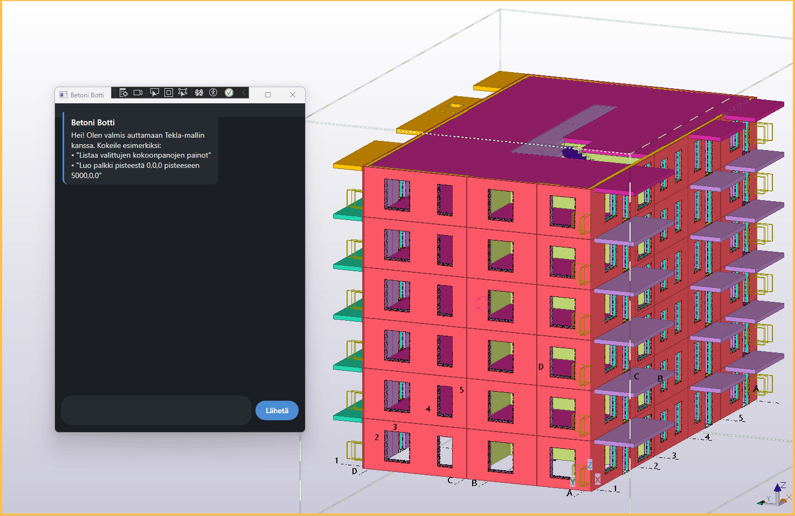

# Tekla AI Agent — "Betoni Botti"

A conversational AI agent for **Tekla Structures**, built with Microsoft's brand-new **Agent Framework** and **Azure OpenAI**. It lets a structural engineer ask questions and issue commands in plain language — "select all columns on floor 02 and total their weight" — instead of clicking through menus.



*Creating a new beam and selecting elements by their identifier, checking weights — all from one chat.*

## Why this exists

I'm a structural engineer interested in transitioning into software/digitalization roles. Rather than building a generic AI demo, I wanted to prove I can bridge both worlds: understand what's actually useful on a real jobsite, and build the software to deliver it — including debugging genuinely hard integration problems along the way (see *Notes from the build* below).

## What it can do

- **List weights** of selected assemblies directly from the model (main part + secondaries, aggregated).
- **Create beams** between two points with a given profile and material.
- **Find and select objects** by name, position mark, profile, material, structural class, or elevation — and chain that straight into the other tools. Ask for "all columns with class 200 between elevation 3000–6000mm" and get their total weight in one sentence; no manual clicking required.

## Architecture

Three layers, deliberately kept independent:

```text
Azure OpenAI  ⇄  Microsoft Agent Framework  ⇄  Tekla Open API
  (the "brain")     (the "nervous system")        (the "hands")
```

- **Agent Framework** turns a plain chat connection into an agent that can call tools, decide *when* to call them, and chain several together to satisfy one request.
- **Tools are plugins.** Every capability implements one small interface (`ITeklaTool`), and the registry discovers them automatically via reflection. Adding a new capability means adding one file — nothing else in the app has to change.

## Tech stack

C# · .NET Framework 4.8 · WPF · Microsoft Agent Framework · Azure OpenAI · Tekla Open API (Tekla Structures 2025)

## Getting started

1. Clone the repo and open `TeklaAIAgent.slnx` in Visual Studio.
2. Copy `appsettings.example.json` → `appsettings.json` inside the `TeklaAIAgent` project folder, and fill in your own Azure OpenAI endpoint, key, and deployment name.
3. Open Tekla Structures with a model loaded, then run the app (F5).

<details>

<summary><strong>Notes from the build</strong> (click to expand)</summary>

Tekla Open API's newest tooling (`TSAppConfigPatcherTask`) turned out to only work with .NET Framework — the assembly-binding redirects it generates simply aren't read by .NET 8's runtime. The project was originally scaffolded on .NET 8 and migrated to .NET Framework 4.8 mid-build once that became clear; both `Microsoft.Agents.AI` and `Azure.AI.OpenAI` target .NET Framework 4.7.2+, so nothing on the AI side had to change.

Adding a second capability that needed to stay out of the public repo (business-specific, not meant for publication) led to a small refactor: the tool registry now discovers `ITeklaTool` implementations via reflection instead of listing them explicitly, so the public codebase never has to reference a class it doesn't contain.

</details>

## What's next

More tools, following the same plugin pattern — a couple are domain-specific enough that I'm keeping them in a private folder for now.
